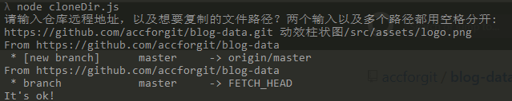

# blog-data

>存放一些在博客中用到的示例代码
>
>此项目会频繁更新，建议 `Star` 或 `Watch`，以便及时得到更新通知

## 如何下载单一文件夹或文件

本仓库中的每个文件夹都是一个独立的项目，互不干扰，如果你只是对其中一个文件夹中的项目，或某一项目中的某个文件感兴趣，所以不想下载所有的代码，这里提供两种方法。

- 参考知乎 [如何从 GitHub 上下载单个文件夹？](https://www.zhihu.com/question/25369412) 下的回答
  推荐其中一个高赞回答中提到的 [DownGit](https://minhaskamal.github.io/DownGit/#/home)，当然，你也可以选择你喜欢的回答

- 如果不想下载安装任何的工具
  本仓库中有个 [/cloneDir/index.js](cloneDir/index.js) 文件，将此文件中的代码复制下来，然后将复制的代码存放到本地，例如命名为 `cloneDir.js`，然后 `node cloneDir.js`，根据控制台的提示输入你所需要的文件(夹)路径即可，例如：
  
  >ps: 这份代码是我还在上大学的时候写的，可以满足基本的功能使用，但不保证没有任何 bug，关于此文件的详细说明可见 [如何在github上下载单个文件夹？](https://blog.csdn.net/DeepLies/article/details/52754980)