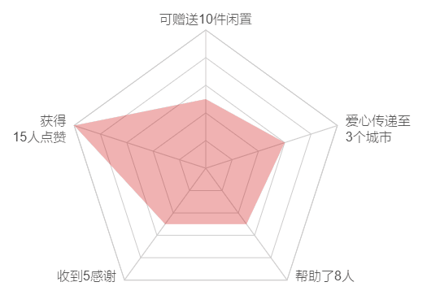
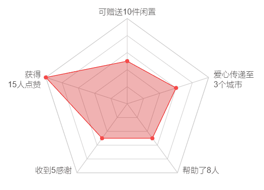

最近做的一个需求，场景之一是绘制一个雷达图，找了一圈，似乎 [AntV](https://github.com/antvis/) 下的 [F2](https://github.com/antvis/f2) 很适合拿来主义：

[](https://antv.alipay.com/zh-cn/f2/3.x/demo/radar/fund-evaluation.html)

但是接着又考虑了一下，我当前所做的项目并不是可视化项目，今后大概率也不会有这种可视化图表的需求，只是为了单个需求一两个图表就引入一个可视化库，性价比有点低，辛辛苦苦优化下来的代码体积，就因为一个冗余的代码库一下子回到解放前，那可真要不得（虽然 [F2](https://github.com/antvis/f2)已经够精简的了）

再加上我刚好对于 `canvas`这块有点兴趣，送上门的练手机会更不可能错过了，除此之外，我看了一下 [F2的文档](https://www.yuque.com/antv/f2/api-index) 看得有点脑壳疼，有看这文档的时间我还不如直接去看 `Canvas`原生 `Api`呢，于是决定自己来搞定这个东西

## 绘制多边形

这个雷达图看起来好像挺简单，实际上还是有点门道的，我考虑了一下，将其分成三部分：

- 正多边形
- 正多边形顶点处文案
- 雷达区域

多边形示意如下（这里以正五边形作为示例）：


这个图其实由多个尺寸不同的正五边形嵌套而成，并且通过 `5`条线将正五边形的对角顶点连在了一起，关键在于需要知道正五边形的五个顶点坐标，这其实就是求解几何数学题

如图，旋转正五边形，令其中心点位于坐标轴原点，其最左侧的一条边平行于 `y`轴，在此状态下的其 `x`坐标最大的点（即最右侧的点）位于 `x`轴上，然后再画一个此正五边形的外接圆，接下来就可以进行求解了


这里之所以这么旋转正五边形，只是为了更方便的求解坐标，你当然也可以令正五边形的一条边平行于 `x`轴或者其他任意的旋转进行求解，只要能取得正多边形各个顶点的相对坐标即可

显而易见<del>神特么显而易见</del>，正五边形的每个顶点的坐标就是：
```
(radius * cosθ, radius * sinθ)
```
这里的 `radius`就是正五边形外接圆半径，`θ`是顶点与原点之间连线和 `x`的夹角

其中 `radius`是我们自己规定的，只剩下 `θ`的求解了，按照上图，如果正多边形最右侧（即 `x`坐标最大）的顶点为第一个顶点，逆时针旋转依次为 第二、第三...第 `n`

显而易见的是，这个 `θ`值其实就是正五边形内角角度的一半，正多边形(`n`)内角角度(`mAngle`)为 `Math.PI * 2 / n`， 则第 `n`个点的坐标为：
```
(radius * cos(θ * (n - 1)), radius * sin(θ * (n - 1)))
```

这里只是拿正五边形举个例子，放宽到正`n`边形都是这个道理

顶点拿到了，正多边形就很好画了，不过还有一点需要注意，实际需求中，一般是要求正多边形是*正着放置*，即底边与 `x`平行，而按照本文这里的求解方式得到的顶点坐标画出来的正多边形，是侧边与 `y`平行，所以需要将得到的 正多边形的坐标进行一定的映射，将之转换为*正着放置*的

`canvas`也提供了这种操作，即 `translate`，只要先把或者后把 `canvas`的坐标系旋转一下，那么画出来的多边形在视觉上看就是 *正着放置*的了

```js
function drawPolygon () {
  // #region 绘制多边形
  const r = mRadius / polygonCount
  let currentRadius = 0
  for (let i = 0; i < polygonCount; i++) {
    bgCtx.beginPath()
    currentRadius = r * (i + 1)
    for (let j = 0; j < mCount; j++) {
      const x = currentRadius * Math.cos(mAngle * j)
      const y = currentRadius * Math.sin(mAngle * j)
      // 记录最外层多边形各个顶点的坐标
      if (i === polygonCount - 1) {
        polygonPoints.push([x, y])
      }
      j === 0 ? bgCtx.moveTo(x, y) : bgCtx.lineTo(x, y)
    }
    bgCtx.closePath()
    bgCtx.stroke()
  }
  // #endregion

  // #region 绘制多边形对角连线
  for (let i = 0; i < polygonPoints.length; i++) {
    bgCtx.moveTo(0, 0)
    bgCtx.lineTo(polygonPoints[i][0], polygonPoints[i][1])
  }
  bgCtx.stroke()
  // #endregion
}
```

## 正多边形顶点处文案

文案的位置其实就是在顶点附近，按照顶点的坐标进行一定的偏移即可，但前面说过了，由于 `canvas`坐标系已经通过 `translate`进行了旋转，这里想要让绘制出来的文字是*正着放置*的，就需要再次将坐标系旋转回去

除此之外，还要注意一下文字绘制的对其方式，这个通过 `textAlign`可以解决：
```js
function drawVertexTxt () {
  bgCtx.font = 'normal normal lighter 16px Arial'
  bgCtx.fillStyle = '#333'
  // 奇数多边形，距离设备顶边最近的点（即最高点的那一点），需要专门设置一下 textAlign
  const topPointIndex = mCount - Math.round(mCount / 4)
  for (let i = 0; i < polygonPoints.length; i++) {
    bgCtx.save()
    bgCtx.translate(polygonPoints[i][0], polygonPoints[i][1])
    bgCtx.rotate(rotateAngle)
    let indentX = 0
    let indentY = 0
    if (i === topPointIndex) {
      // 最高点
      bgCtx.textAlign = 'center'
      indentY = -8
    } else {
      if (polygonPoints[i][0] > 0 && polygonPoints[i][1] >= 0) {
        bgCtx.textAlign = 'start'
        indentX = 10
      } else if (polygonPoints[i][0] < 0) {
        bgCtx.textAlign = 'end'
        indentX = -10
      }
    }
    // 如果是正四边形，则需要单独处理最低点
    if (mCount === 4 && i === 1) {
      bgCtx.textAlign = 'center'
      indentY = 10
    }
    // 开始绘制文案
    mData[i].titleList.forEach((item, index) => {
      bgCtx.fillText(item, indentX, indentY + index * 20)
    })
    bgCtx.restore()
  }
}
```

## 雷达区域

雷达区域就是文章开头那个图中的红色线框内的区域，这个区域也是一个多边形，只不过不是正的，但坐标的求解其实和正多边形是差不多的，只需要在求坐标的过程中，对坐标参数进行一定比例的缩放罢了，而这个比例就是所在的顶点代表的实际值与总值的比例（比如，100分是满分，第一个点只有80分，那么就是 `80%`）

如果只是一个静态图，那么到此为止也就没什么好说的了，求得雷达区域各个点坐标，然后连接路径、闭合路径，再描边就完事，但如果是想要做成文章开头那种雷达区域动态填充的，就稍微要麻烦一点了

我一开始的想法是，动态求解每一帧雷达区域的各个顶点坐标，后来算了半天发现也太麻烦了，怎么扯出来那么多数学公式，这就算是能求出来性能应该也好不到哪里去吧

>遂弃之，另寻他法，忽得一技

文章开头的那种动态填充法，看起来很像是一个圆以扇形打开的样子啊，看了一下 `canvas`里有个叫 `clip`的东西，于是想到，只要先将需要的雷达区域裁切(`clip`)好，再用一个足够覆盖这个裁切区域的圆放到这个裁切面上进行动态扇形展开，不就达到目的了吗？

```js
for (let i = 0; i < mCount; i++) {
  // score不能超过 fullScore
  score = Math.min(mData[i].score, mData[i].fullScore)
  const x = Math.cos(mAngle * i) * score / mData[i].fullScore
  const y = Math.sin(mAngle * i) * score / mData[i].fullScore
  i === 0 ? ctx.moveTo(x, y) : ctx.lineTo(x, y)
}
ctx.closePath()
ctx.clip()
// ...
ctx.moveTo(0, 0)
ctx.arc(0, 0, canvasMaxSize, 0, currentAngle)
ctx.closePath()
ctx.fill()
```

效果如图：


似乎可行，但是与文章开头的那个图对比了一下，发现还有点欠缺，头图的雷达区域是有红色描边的，并且在完整绘制完毕后，雷达区域的每个顶点处都有红色小圆点

顶点处的红色小圆点好办，顶点坐标是已知的，无非是在顶点处在画个小圆罢了，但是描边有点麻烦

描边的长度是紧跟雷达区域绘制进度的，这就需要知道每一帧雷达区域每个顶点的坐标，这不又回去了吗？说好了不搞那么多公式计算的

后来又想了下，如果事先把雷达图最终态画好，然后用一个蒙层遮住，接着再把这个蒙层动态打开不也行吗？

又看了一下`canvas`的文档，发现了一个叫 `globalCompositeOperation`的 `API`，就是它了

为了方便绘制，我重新划分了一下，一共用了三个 `canvas`

第一个 `canvas`作为最终呈现效果的画布，第二个用于绘制完整版的静态雷达区域，第三个则绘制用于给完整版的静态雷达区域进行遮罩的蒙层，三个`canvas`一组合，就达到了预期效果：



## 小结

本文完整示例 [Live Demo]() 和 [示例代码]() 已经上传，感兴趣的可以亲自试下