# 原生JS控制多个滚动条同步跟随滚动

在一些支持用 `markdown`写文章的网站，例如 `掘金` 或者 `CSDN`等，后台写作页面，一般都是支持 `markdown`即时预览的，也就是将整个页面分成两部分，左半部分是你输入的 `markdown`文字，右半部分则即时输出对应的预览页面，例如下面就是 `CSDN`后台写作页面的 `markdown`即时预览效果：


本文不是阐述如何从 `0`实现这种效果的（后续 **很可能** 会单出文章，），抛开其他，单看页面主体中左右两个容器元素，即 `markdown`输入框元素和预览显示框元素

本文要探讨的是，当这两个容器元素的内容都超出了容器高度，即都出现了滚动框的时候，如何在其中一个容器元素滚动时，让另外一个元素也随之滚动。

---

## `DOM`结构

既然是与滚动条有关，那么首先想到 `js`中控制滚动条高度的一个属性： `scrollTop`，只要能控制这个属性的值，自然也就能控制滚动条的滚动了。

对于以下 `DOM`结构：

```html
<div id="container">
  <div class="left"></div>
  <div class="right"></div>
</div>
```

其中，`.left`元素是左半部分输入框容器元素，`.right`元素是右半部分显示框容器元素，`.container`是它们共同的父元素。

由于需要溢出滚动，所以还需要设置一下对应的样式（只是关键样式，非全部）：
```css
#container {
  display: flex;
  border: 1px solid #bbb;
}
.left, .right {
  flex: 1;
  height: 100%;
  word-wrap: break-word;
  overflow-y: scroll;
}
```
再向 `.left`和 `.right`元素中塞入足够的内容，让二者出现滚动条，就是下面这种效果：

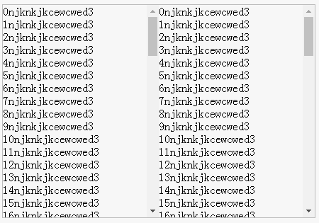

样式是出来个大概了，下面就可以在这些 `DOM`上进行一系列的操作了。

---

## 初次尝试

大致思路，监听两个容器元素的滚动事件，在其中一个元素滚动的时候，获取这个元素的 `scrollTop`属性的值，同时将此值设置为另外一个滚动元素的 `scrollTop`值即可。

例如：

```
var l=document.querySelector('.left')
var r=document.querySelector('.right')
l.addEventListener('scroll',function(){
  r.scrollTop = l.scrollTop
})
```

效果如下：

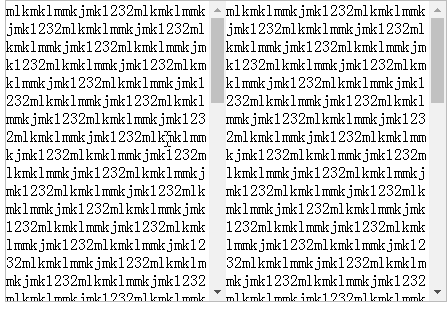

似乎很不错，但是现在是不仅想让右边跟随左边滚动，还想左边跟随右边滚动，于是再加以下代码：

```
l.addEventListener('scroll',function(){
  r.scrollTop = l.scrollTop
})
```

看上去很不错，然而，哪有那么简单的事情。

这个时候你再用鼠标滚轮进行滚动的时候，却发现滚动得有点吃力，两个容器元素的滚动似乎被什么阻碍住了，很难滚动。

仔细分析，原因很简单，当你在左边滚动的时候，触发了左边的滚动事件，于是右边跟随滚动，但是与此同时右边的跟随滚动也是滚动，于是也触发了右边的滚动，于是左边也要跟随右边滚动...然后就进入了一个类似于相互触发的情况，所以就会发现滚动得很吃力。

---

## 解决`scroll`事件同时触发的问题

想要解决上述问题，暂时有以下两种方案。

### 将 `scroll`事件换成 `mousewheel`事件

由于 `scroll`事件不仅会被鼠标主动滚动触发，同时改变容器元素的 `scrollTop`也会触发，元素的主动滚动其实就是鼠标滚轮触发的，所以可以将`scroll`事件换成一个对鼠标滚动敏感而不是元素滚动敏感的事件：'mousewheel'，于是上述监听代码变成了：

```
l.addEventListener('mousewheel',function(){
    r.scrollTop = l.scrollTop
})
r.addEventListener('mousewheel',function(){
    l.scrollTop = r.scrollTop
})
```

效果如下：

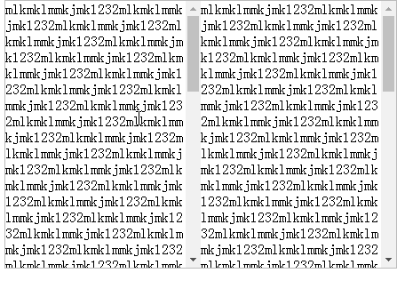

似乎是有点用，但是实际上还有两个问题。

- 当滚动其中一个容器元素的时候，另外一个容器元素虽然也跟着滚动，但滚动得并不流畅，高度有明显的瞬间弹跳

在网上找了一圈，没有找到关于 `wheel`事件滚动频率相关内容，我推测这可能就是此事件的一个 `feature`

鼠标每次滚动基本上都并不是以 `1px`为单位的，其最小单元远比 `scroll`事件小的多，我用我的鼠标在 `chrome`浏览器上滚动，每次滚过的距离都恰好是 `100px`，不同的鼠标或者浏览器这个数值应该都是不一样的.

如果你的鼠标质量比较好，齿轮比较精细，那么应该就会小于 `100px`， 跳动也就不会那么大，我的鼠标是公司给配的电脑自带的，作用只限于能用，所以齿轮刻度比较大.

而 `wheel`事件其实真正监听的是鼠标滚轮滚过一个齿轮卡点的事件，这也就能解释为何会出现弹跳的现象了。

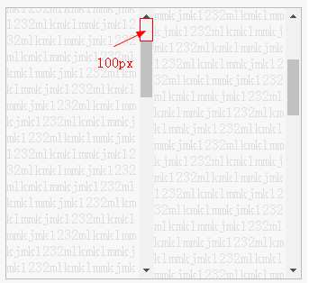

一般来说，鼠标滚轮每滚过一个齿轮卡点，就能监听到一个`wheel`事件，从开始到结束，被鼠标主动滚动的元素已经滚动了 `100px`，所以另外一个跟随滚动的容器元素也就瞬间跳动了 `100px`

而之所以上述 `scroll`事件不会让跟随滚动元素出现瞬间弹跳，则是因为跟随滚动元素每次 `scrollTop`发生变化时，其值不会有 `100px`那么大的跨度，可能也没有小到`1px`，但由于其触发频率高，滚动跨度小，最起码在视觉上就是平滑滚动的了。

如果你想让右侧滚动框也平滑滚动，也是可以做到的，当每次监听到 `wheel`事件的时候，也别管它相比于上次是差了`100px`还是 `50px`的，始终都让右侧的跟随滚动框按照 `1px`（或者再稍大点的跨度，只要给人视觉上的感受是平滑滚动并且延迟不是太大就行了）来滚动，连续滚动 `100`次，那就是`100px`了，同样能到达准确的位置，例如如下代码：
```
function scrollToY(rightELe, toY, step=10) {
    let diff = rightELe.scrollTop - toY
    let realStep = diff > 0 ? -step : step
    if(Math.abs(diff) > 1) {
        rightELe.scrollTop = rightELe.scrollTop + realStep
        requestAnimationFrame(()=>{
            scrollToY(rightELe, toY, step)
        })
    } else {
        rightELe.scrollTop = toY
    }
}
```

- `wheel`只是监听鼠标滚轮事件，但如果是用鼠标拖动滚动条，就不会触发此事件，另外的容器元素也就不会跟随滚动了

这个其实很好解决，用鼠标拖动滚动条肯定是能触发 `scroll`事件的，而在这种情况下，你肯定能够很轻易地判断出这个被拖动的滚动条是属于哪个容器元素的，只需要处理这个容器的滚动事件，另外一个跟随滚动容器的滚动事件不做处理即可。

- `wheel`事件的兼容问题

`wheel`事件是 `DOM Level3`的标准事件，但是除了此事件之外，还有很多非标准事件，不同的浏览器内核使用不同的标准，所以可能还需要按情况来进行兼容，具体可见 [MDN MouseWheelEvent](https://developer.mozilla.org/zh-CN/docs/Web/API/MouseWheelEvent)

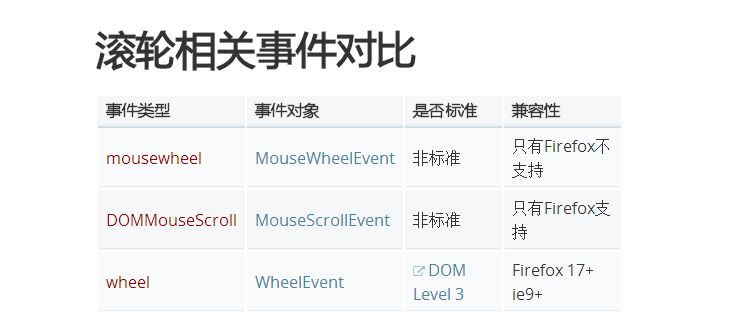

---

## 实时判断

如果你难以忍受 `wheel`的弹跳，以及各种兼容，那么其实还有另外的路可以走得通，依旧是 `scroll`事件，只不过需要做一些额外的工作。

`scroll`事件的问题在于，没有判断当前主动滚动的是哪一个容器元素，只要确定了主动滚动的容器元素，这事就好办了，例如上述使用 `wheel`事件中，用鼠标拖动滚动条之所以能够使用 `scroll`事件，就是因为能够很容易地确定当前主动滚动容器元素是哪一个。

所以，问题的关键在于，如何判断出当前主动滚动的容器元素，只要解决了这个问题，剩下的就很好办了。

不论是鼠标滚轮滚动还是鼠标按在滚动条上拖动滚动条滚动，都会触发 `scroll`事件，并且这个时候，在坐标系 `Z`轴上，鼠标的坐标肯定是位于滚动容器元素所占的面积之内的，也就是说，在 `Z`轴上，鼠标肯定是悬浮或者位于滚动容器元素之上。

鼠标在屏幕上移动的时候，是可以获取到鼠标当前坐标的。


其中，`clientX`和 `clientY`就是当前鼠标相对于视口的坐标，可以认为，只要这个坐标在某个滚动容器的范围内，则认为这个容器元素就是主动滚动容器元素，容器元素的坐标范围可以使用 `getBoundingClientRect`进行获取。

下面是鼠标移动到 `.left`元素中的示例代码：

```
if (e.clientX>l.left && e.clientX<l.right && e.clientY>l.top) {
    // 进入 .left元素中
}
```

这样确实是可以的，不过考虑到两个滚动容器元素几乎占据了整个屏幕面积，所以 `mousemove`所要监听的面积未免有点大，对于性能可能要求较高，所以其实可以换成 `mouseover`事件，只需要监听鼠标有没有进入到某个滚动容器元素即可，也省去上述的坐标判断了。

```
l.addEventListener('mouseover',function(){
  // 进入 .left滚动容器元素内
})
```

当确定了鼠标主动滚动的容器元素是哪一个时，只需要处理这个容器的滚动事件，另外一个跟随滚动容器的滚动事件不做处理即可。

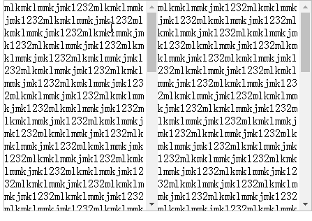

嗯，效果很不错，性能也很好，`perfect`，可以收工喽~

那一屋！

事情没有那么简单！


---

## 按比例滚动

上述示例全部是在两个滚动容器元素的内容高度完全一致的情况下的效果，如果这两个滚动容器元素的内容高度不同呢？

那就是下面这种效果：

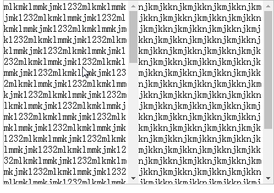

可见，由于两个滚动容器元素的内容高度不同，所以最大的 `scrollTop`也就不同，就会出现当其中一个 `scrollTop`值较小的元素滚到底时，另外一个元素还停留在一半，或者当其中一个 `scrollTop`值较大的元素才滚到一半时，另外一个元素就已经滚到底了。

这种情况很常见，例如你用 `markdown`写作时，一个一级标题标记 `#`在编辑模式下占用的高度，一般都是小于预览模式占用的高度的，这样就出现了左右两侧滚动高度不一致的情况。

所以，如果将这种情况也考虑进来的话，那么就不能简单地为两个滚动容器元素相互设置 `scrollTop`值那么简单。

虽然无法固定住滚动容器内容的高度，但是有一点可以确定，滚动条最大滚动高度，或者说 `scrollTop`的值，肯定是与滚动容器内容的高度与滚动容器本身的高度呈一定的关系。

由于需要知道滚动容器内容的高度，还要存在滚动条，所以需要给此容器元素加个子元素，子元素高度不限，就是滚动容器内容的高度，容器高度固定，溢出滚动即可。

```html
<div id="container">
  <div class="left">
	 <div class="child"></div>
  </div>
  <div class="right">
	  <div class="child"></div>
  </div>
</div>
```

结构示例如下：

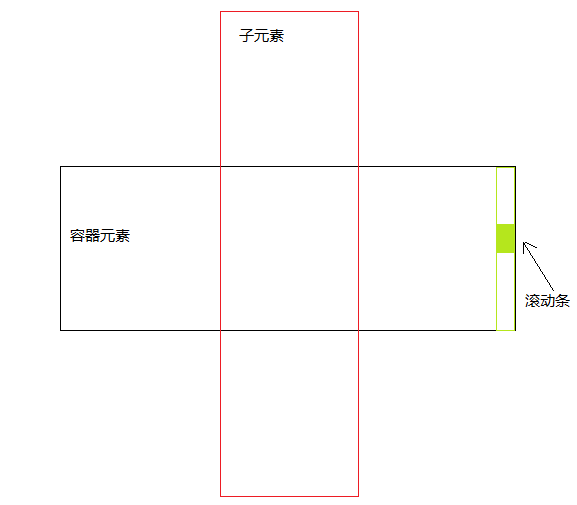

通过我的观察推论与实践验证，已经确定下来了它们之间的关系，很简单，就是最基本的加减法运算：
```
滚动条的最大滚动高度(scrollTopMax) = 滚动容器内容的高度(即子元素高度ch) - 滚动容器本身的高度(即容器元素高度ph)
```

即

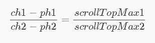

也就是说，如果已经确定了滚动容器内容的高度(即子元素高度ch)与滚动容器本身的高度(即容器元素高度ph)，那么就一定能确定滚动条的最大滚动高度(`scrollTop`)，而这两个高度值基本上都是可以获取到的，所以就能得到 `scrollTop`

因此，想要让两个滚动元素容器等比例上下滚动，即其中一个元素滚到头或者滚到底，另外一个元素也能对应滚到头和滚到底，那么只要得到这两个滚动容器元素之间的 `scrollTop`最大值的比例(`scale`)就行了。

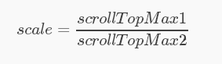

确定了 `scale`之后，实时滚动时，只需要获取主动滚动容器元素的 `scrollTop1`，就能得到另外一个跟随滚动的容器元素对应的 `scrollTop2`：

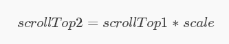

思路弄清晰了，写代码就是很容易的事情了，效果如下：

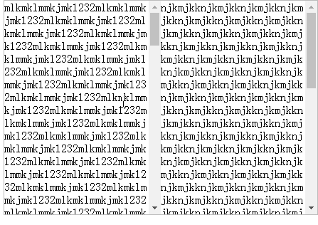

很顺滑~


---

## 小结

上述基本上已经实现了需求，可能在实践过程中还需要根据实际情况来进行一定的修改，例如如果你编写一个 `markdown`的在线编辑和预览页面，就需要根据输入内容的高度实时更新 `scale`值，不过主体已经搞定，小修小改就没什么难度了。

另外，本文所述不仅是针对两个滚动容器元素的跟随滚动，同时也可扩展开来，更多的元素间的跟随滚动都是可以根据本文思路来实现的，本文只是为了方便讲解而具体到了两个元素上。
