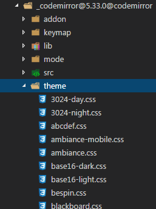
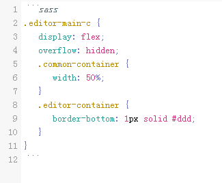
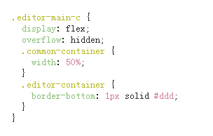
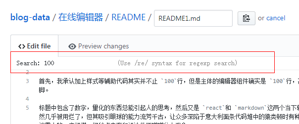
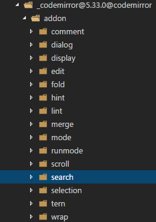
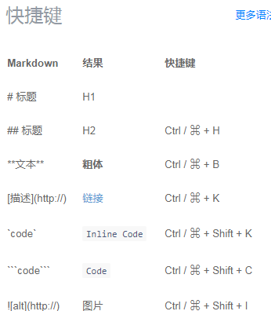
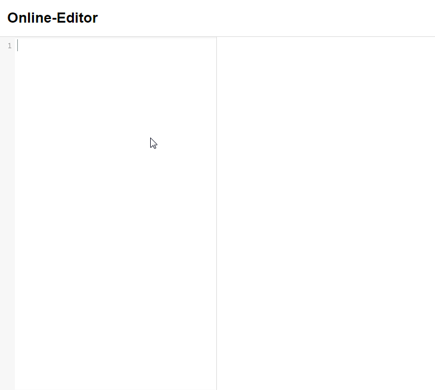

# 手把手教你用 100行代码实现基于 react的 markdown 输入 + 即时预览在线编辑器（二）

---

>本文介绍如何使用 [Ace](https://github.com/ajaxorg/ace)和 [CodeMirror](https://github.com/codemirror/CodeMirror)来实现一个基于 `react`的 `markdown` 输入 `+` 即时预览在线编辑器

---

## Ace版本

`Ace`算是一个久经考验的老牌编辑器插件了，现在很多大公司都在用这个东西，似乎 [Github](https://github.com)曾经就使用 `Ace`用于构建它的在线编辑器（虽然现在不用了）。

`Ace`在[Github](https://github.com/ajaxorg/ace)上只是存放了其项目，更多详细的介绍，例如如何开始以及 `API`等文档都放在它的[官网上](https://ace.c9.io)

>温馨提示：
>
>1. 如果你打开其 [官网](https://ace.c9.io)发现加载失败，或者页面不全，那么可能需要你翻墙重新请求一遍才行，因为虽然其官网的大部分资源墙内就能访问，但一些脚本文件，例如 `jQuery`是墙外的，所以可能出现数据加载失败的情况。
>2. `Ace`的文档读起来可能有些困难，这里的困难并不是指其文档都是英文的，如果只是英文阅读障碍，在线翻译一下也就`ok`了，而是说你可能不知道该从哪里阅读，不知从何下手，这也是大部分开源项目的通病，这个问题可能就需要你多翻看几遍，找到文档编写规律后再阅读应该就容易多了。

---

### 引入 `Ace`

本文所要实现的编辑器虽然是基于 `Ace`，但是没有直接使用 `Ace`，而是使用了其一个封装插件 [brace](https://github.com/thlorenz/brace)，至于为什么不直接使用 `Ace`，[brace](https://github.com/thlorenz/brace)项目也有说明，可以自己去看看，另外，由于本文所要实现的编辑器还是基于 `React`的，所以为了使用方便，需要对 `Ace`进行一层封装，将其包裹成一个 `React`组件。

`Github`上也有人做过这种事情了，例如 [react-ace](https://github.com/securingsincity/react-ace)，由于此项目规模较大，`API`和方法很多，此项目只是封装了其部分功能，我看了下[react-ace](https://github.com/securingsincity/react-ace)的封装代码，可能它的封装无法满足我的需求，所以我就抽出了其中一部分代码，并进行了稍微的修改。

另外，本文所要实现的编辑器是间接基于 `Ace`，直接基于 `brace`的，所以所要安装的包是 [brace](https://github.com/thlorenz/brace):

>npm i brace -S

基本的 `DOM`结构和 [手把手教你用 100行代码实现基于 react的 markdown输入+即时预览在线编辑器（一）](https://juejin.im/post/5a40792a6fb9a0450671da48)是差不多的，只不过在左侧输入容器的子元素由原来具有 `contentEditable="plaintext-only"`属性的 `div`换成了 `Ace`组件：
```js
<AceEditor
  mode="markdown"
  theme="github"
  wrapEnabled={true}
  tabSize={2}
  fontSize={14}
  showGutter={false}
  height={state.aceBoxH + 'px'}
  width={'100%'}
  debounceChangePeriod={60}
  onChange={this.onContentChange}
  onScroll={this.containerScroll.bind(this, 1)}
  name="aceEditorMain"
  editorProps={{$blockScrolling: true}}/>
```
上述 `<AceEditor/>`的组件属性都是能在 [Ace](https://ace.c9.io)文档里找到的，这里只简单说明一下：

>1. `mode`：编辑器的整体模式或样式，这里取值为 `markdown`，表明需要用这个编辑器来输入 `markdown`文本，这样编辑器就会进行相应的初始设置。
>2. `theme`：编辑器主题，这里使用了 `github`这个主题。
>3. `wrapEnabled`：当输入的一句文本比一行的长度要长时，是否允许换行。
>4. `tabSize`：使用几个空格来表示表示一次 `Tab`按键。
>5. `fontSize`：文本的字体大小
>6. `height`：编辑器的高度，单位为 `px`。
>7. `width`：编辑器的宽度，单位为 `px`。
>8. `debounceChangePeriod`：多长时间对输入响应一次，单位为 `ms`，类似于节流。
>9. `onChange`：文本框内容发生变化时的回调函数。
>10. `onScroll`：文本框内容发生滚动时的回调函数。
>11. `name`：编辑器的 `id`。
>12. `editorProps`：当在文本框内输入内容时，是否需要滚动条进行响应的滚动定位。

---

### 功能实现

大部分的功能点与[手把手教你用 100行代码实现基于 react的 markdown 输入+即时预览在线编辑器（一）](https://juejin.im/post/5a40792a6fb9a0450671da48)这篇文档的类似，不过由于使用 `Ace`与 直接的 `contentEditable="plaintext-only"`属性的 `div`还是存在很多不同的地方，需要对这些地方进行相应的调整。

- `onContentChange`方法

当文本内容发生变化时，`<AceEditor/>`组件的回调函数 `onChange`被触发，其会返回一个值，此值就是当前编辑器的完整文本内容字符串，所以直接接收即可，无需做其他的额外操作：
```js
onContentChange(value) {
  this.previewWrap.innerHTML = marked(value)
}
```

- 获取 `<AceEditor/>`组件内容高度以及`scrollTop`值。

`Ace`使用了一种 `VirtualRenderer`的技术，你可能无法直接使用 `DOM`来获取编辑器本身的某些属性和方法，需要间接地调用 `Ace`暴露出来的方法才行。

例如，你需要这样获取编辑器文本内容的高度：
```js
editorHandler.getSession().getScreenLength()*editorHandler.renderer.lineHeight
```

`editorHandler`是编辑器的一个 `Handler`，可以使用此 `handler`来完成一些对编辑器的操作，`getScreenLength()`方法获取到编辑器内当前所有文本的总行数，这个行数是包括换行的，`lineHeight`是每行文本的高度，二者相乘即得到内容的总高度，我没看到 `Ace`直接暴露出获取内容总高度的方法，所以使用了这种操作。

如果你想获取编辑器滚动的高度 `scrollTop`,那么就需要使用下面这个方法：
```js
editorHandler.renderer.getScrollTop()
```

或者直接调用属性也可以：
```js
editorHandler.renderer.scrollTop()
```

其中，`editorHandler`这个 `Handler`我再封装 `Ace`的时候，已经暴露出来了，需要的时候导出即可：
```js
import AceEditor, {editorHandler} from '../../Component/AceEditor/index'
```

---

### 代码高亮

在 `<AceEditor/>`编辑器内输入的文本高亮，是由编辑器组件的两个属性控制的：`mode`和 `theme`，当你指定了这两个属性时，你在编辑器内输入的文本，无论是 `markdown`标记还是代码段就都已经自动高亮的了，例如，在编辑器内输入下述代码段，编辑器会自动对其进行高亮处理：

<pre>
<code>
```css
#container {
  display: flex;
  border: 1px solid #bbb;
}
.left, .right {
  flex: 1;
  height: 100%;
  word-wrap: break-word;
  overflow-y: scroll;
}
```
</code>
</pre>


输入效果示例如下：


至于预览内容的高亮，依旧是借助 [highlight.js](https://github.com/isagalaev/highlight.js)，不过这个东西感觉内置的样式有点问题（也可能是我使用方法有问题），所以我只是使用了其 `js`脚本，用于让 `marked`输出正确格式的 `html`，至于样式，我没有用 `htghlight.js`内置的，而是参照其样式自己修改了一份 `js-highlight.css`。

这样做的好处是，既可以去除冗余的代码减小代码体积，同时也能自定义自己喜欢的颜色主题。


---

## CodeMirror版本

[CodeMirror](https://github.com/codemirror/CodeMirror) 和 [Ace](https://github.com/ajaxorg/ace) 都是开源在线编辑器中的佼佼者，在 `Github`上的星数也都不相上下，不过据我至今的观测来看，无论是调试还是文档方面，`CodeMirror`都比 `Ace`更加友好得多，如果你对着 `CodeMirror`的文档无从下手的话，那么建议你先去看看 `Ace`的文档，然后再回来看 `CodeMirror`的，你就会发现，二者的入手体验真的不是在一个层次的。

---

### 引入 `CodeMirror`

`CodeMirror`的文档基本上也都是放在其[官网](http://codemirror.net/)上，[Github](https://github.com/codemirror/CodeMirror)上存放了其源码以及各种 `Demo`

下载完成后，同样的，由于本文所要实现的编辑器是基于 `React`，所以最好将其封装成一个 `React`组件，[Github](https://github.com/JedWatson/react-codemirror)上也已经有人做过这个事了，不过和上述 [react-ace](https://github.com/securingsincity/react-ace)的原因类似，[react-codemirror](https://github.com/JedWatson/react-codemirror)这个项目也只是封装了部分常用的 `API`和功能，直接拿来用也无法满足我的要求，所以我就在其基础上进行了稍微的修改。

封装完成后的 `CodeMirror`组件的使用，可以类似于下面这种：
```jsx
<CodemirrorEditor
  ref="editor"
  onScroll={this.containerScroll.bind(this, 1)}
  onChange={this.updateCode.bind(this)}
  options={
    lineNumbers: true,
    theme: 'solarized',
    tabSize: 2,
    lineWrapping: true,
    readOnly: false,
    mode: 'markdown',
    // 是否自动闭合标签，基于 codemirror/addon/edit/closetag
    autoCloseTags: true,
    // 自定义快捷键
    extraKeys: this.setExtraKeys()
  }
  autoFocus={true}/>
```

这些属性所代表的含义都可以在 [CodeMirror](http://codemirror.net/)的官网上找到，这里只稍微说明下。

>1. `ref`: 用于方便组件内部对 `CodeMirror`容器的引用
>2. `onScroll`: 编辑器内容滚动时触发的回调
>3. `onChange`: 编辑器内容发生变化时触发的回调
>4. `options`: 一些配置参数，例如是否显示行数、编辑器主题、缩进空格数、是否允许软换行、是否只读、文本内容的模式、是否自动闭合标签、自定义快捷键等
>5. `autoFocus`: 是否自动聚焦

---

### 功能实现

大部分的功能点与上节`Ace`的类似，不过由于代码逻辑不同，所以需要细微调整。

- `containerScroll`

编辑器内容滚动时触发的回调函数，调用 `onScroll`方法，此方法返回了当前编辑器的相关位置参数，可以直接获取到滚动条的 `scrollTop`值，可以借助 `CodeMirror`组件暴露出来的编辑器句柄 `CodemirrorHandler`，通过调用 `scrollTo`函数来控制滚动条的滚动。
```js
CodemirrorHandler.scrollTo(null, this.previewContainer.scrollTop / state.scale)
```

- `updateCode`

当编辑器内容发生变化出触发的回调函数，可以直接获得编辑器输入的文本内容，对此内容调用 `marked`方法将其编译成对应的 `HTML`。


---

### 代码高亮

`CodeMirror`也可以对输入的内容进行高亮处理，`CodeMirror`组件的 `mode`属性用于指定编辑器的模式，当指定此值为 `markdown`时，编辑器就会对输入的内容按照 `markdown`的语法来进行高亮处理，例如添加 `css`类名等，除此之外，还需要配合样式才能达到视觉上的效果。

`CodeMirror`内置了很多主题样式，你可以根据自己的需求进行选择：



我这里选择了 `solarized`这个主题，所以需要将此主题对应的样式文件引入：
```js
require('codemirror/theme/solarized.css')
```

除此之外，你还需要为 `CodeMirror`组件显式配置这个主题才能生效：
```js
theme: 'solarized'
```

输入高亮的效果如下：



至于预览高亮样式，操作与上节 `Ace`的相同，同样是借助 `highlight.js`，并且自定义了一份样式表，用于预览高亮的显示效果,预览效果如下：



---

### 搜索功能

在使用 `Github`在线编辑器的时候，会发现 `Github`的编辑器是具备搜索功能的，就像下面这样：



`Ace`和 `CodeMirror`都是支持此功能的，不过 `Ace`的文档实在是不太友好，也不好调试，各种问题，所以我没有深入研究，但是 `CodeMirror`就很好，我看了下 `CodeMirror`文档中关于编辑器内搜索的部分，发现实现起来没什么难度，所以就花了点时间弄清楚其原理，然后给实现了一下。

`CodeMirror`没有预定义搜索功能，不过其代码包中有搜索功能的 `Addons`包，只要将 `search.js`这个 `addon`包引入，就可以轻松实现搜索功能了，除了搜索 `addon`包，还有其他很多相关功能包，可根据实际需求进行增添：



`Addons`这个东西我觉得很好，这样一来对于一些可有可无的功能也就不必纠结了，如果不想用那个功能，就不引用相关 `addon`包就行，减小打包后的代码体积，如果想用了就加上，很方便。

想要实现编辑器内搜索功能，首先你需要将搜索的功能包引入：
```js
require('codemirror/addon/search/search')
```
这样，编辑器就具备搜索功能了，不过还需要相应的样式，才能实现视觉上的统一，此功能包基于另外一个功能包 `dialog.js`，搜索框就是此功能包实现的，所以需要引入此功能的样式：
```js
require('codemirror/addon/dialog/dialog.css')
```

想要调出搜索框，只需要使用快捷键 `Ctrl+F(Win)`或者 `Cmd+F(Mac)`，然后在搜索框内输入要搜索的字符，按下 `Enter`就行，和在 `Github`在线编辑器内搜索功能的使用时一样的，并且搜索结果高亮显示。

如果你想跳到下一个搜索结果，只需要 `Ctrl-G(Win)`或者 `Cmd-G(Mac)`，如果想跳到上一个搜索结果，只需要 `Shift-Ctrl-G(PC)`或者`Shift-Cmd-G(Mac)`


---

## 自动闭合标签

当你在写 `HTML`结构的时候，有些编辑器会帮你自动闭合标签，例如输入 `<div>`，当输入第 5个字符 `>`的时候，编辑器会自动补全 `</div>`，`CodeMirror`也有个这样的功能包：`closetag`:
```js
require('codemirror/addon/edit/closetag')
```

当你引入此功能包，在编辑器内输入 `HTML`代码段的时候，输入 `<div>`，当键入最后一个字符 `>`的时候，你就会看到……编辑器没反应，没有帮你自动补全。

仔细看了下文档，发现原来还需要进行显示配置才行：
```js
autoCloseTags: true
```

配置好此属性后，就可以自动补全了。

---

## 全屏显示

`CodeMirror`也有全屏显示的功能包：`fullscreen.js`：
```js
require('codemirror/addon/display/fullscreen')
```

使用此功能时，需要引入对应的样式文件：
```js
require('codemirror/addon/display/fullscreen.css')
```

文档上说得很清楚，想调起此功能，只需要将光标定位在编辑器内，然后按下 `F11`键，你就会看到……确实是全屏了，`But`，你再仔细看看就会发现，你按的这个 `F11`调起的其实是浏览器的快捷键而非是编辑器的快捷键，因为 `js-DOM`再厉害，翻江倒海的能力也就在浏览器内部，怎么可能会把浏览器包括标签、选项卡、边栏在内的 `Native`部件都给隐藏了？而且这种全屏，只是除去了浏览器无关部件，文档内容相应放大，布局之类的没有任何变化，并不是 `fullscreen.js`所要实现的功能。

`fullscreen.js`所实现的功能是隐藏掉浏览器页面中除了编辑器之外所有的元素，让编辑器占满整个页面。

想要实现这种效果，你需要自定义快捷键，用于调起功能，并且拦截触发浏览器自带的全屏功能，自定义快捷键也是通过配置来实现的，例如如果你想要当按下 `F11`的时候，调起全屏功能，并且按 `Esc`的时候退出全屏：
```js
extraKeys: {
  'F11'(cm) {
      // 全屏
      cm.setOption('fullScreen', !cm.getOption('fullScreen'))
    },
    'Esc'(cm) {
      // 退出全屏
      if (cm.getOption('fullScreen')) cm.setOption('fullScreen', false)
    }
}
```

`extraKeys`就是用于配置快捷键的属性，除了全屏快捷键，你还可以配置其他的快捷键，例如 [掘金](https://juejin.im) 的在线编辑器就提供了一些输入 `markdown`代码段的快捷键:



使用 `CodeMirror`来实现这种快捷键也没什么难度，主要是你要熟悉文档，知道调用哪些方法来达到目的。

```js
[
  { name: 'Ctrl-H', value: '## ', offset: 0 },
  { name: 'Ctrl-B', value: '**', offset: 1 },
  { name: 'Ctrl-K', value: '[]()', offset: 3 },
  { name: 'Alt-K', value: '``', offset: 1 },
  { name: 'Alt-C', value: '```js\n\n```', offset: 0, offsetLine: 1 },
  { name: 'Alt-I', value: '', offset: 1 },
  { name: 'Alt-L', value: '* ', offset: 0 }
]
```

`CodeMirror`还有其他的 `Addons`，并且在其 [Github](https://github.com/codemirror/CodeMirror/tree/master/demo)上也都有相应的 `Demo`，根据实际需求添加即可。

---

## 小记

富文本编辑器一共都是前端领域的天坑，本文基于 `Ace`和 `CodeMirror`实现的编辑器只是用到了这两个项目很少的一部分功能，不过也足以满足大部分的需求了。

另外，说实话，`Ace`的文档真是不太好看，而且这个编辑器也不太好使用，无法进行精确的自定义控制，别看上面我写的内容不是太多，但是为了弄明白 `Ace`的一些情况，从而做出一个 `Demo`并写出这篇文章，我最近几天工作之余的所有自由时间几乎都贡献在上面了，对开发者真的有点不太友好，相对而言，`CodeMirror`做得就很好，不会有这样那样的问题，就算有问题，也容易调试，最起码在我看来是这样，所以，我大概明白为何 `Github`会选用 `CodeMirror`而不是 `Ace`来用于构建其在线编辑器了。


