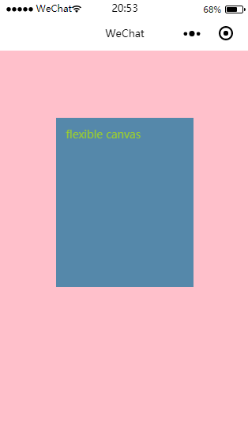

# 小程序 Canvas绘图不同尺寸设备 UI兼容的两个解决方案

最近做的一个需求，遇到一个问题，小程序绘图目前只支持 `px`单位，设计图一般是以 `iphone6`为基准设计，如果严格 `iphone6`的尺寸进行代码编写，放在其他尺寸的设备上，肯定是不行的，所以需要按照设备进行等比例兼容，这里给出两个解决方案

先假设一个需求，下面是最终实现的效果(以 `iphone6`为基准)，下面就以此为目标进行展开



>整个页面被 `canvas`组件覆盖(在 `iphone6`下宽高为 `375x603`)，中间偏蓝色的是一张图片，图片上有一行字 `flexible canvas`

## 类 `rem`

等比例缩放单位的解决方案，也就是以一个尺寸为基准，例如 `iphone 6`，然后其他设备按照这个标准，在保证宽度铺满设备的前提下，进行等比例缩放

绘制的代码很简单：
```js
const ctx = wx.createCanvasContext('shareCard')
ctx.drawImage('../58a.png', this.remSize(85), this.remSize(100), this.remSize(205), this.remSize(250))
ctx.setFontSize(this.remSize(16))
ctx.setFillStyle('yellowgreen')
ctx.fillText('flexible canvas', this.remSize(100), this.remSize(130))
ctx.draw()
```

其中，`remSize` 这个方法就是用于等比例缩放尺寸
```js
remSize (num) {
  return num * scale
}
```

其中，`scale`就是当前设备与设计基准设备 `iphone6`的宽度比例
```js
scale = wx.getSystemInfoSync().windowWidth / 375
```

当前是以铺满设备宽度为目标，所以高度不关心，即 **以宽度为参考，高度 auto**

以上，就基本实现需求，做法很简单，这是通常一贯的解决方案
由于示例的需求比较简单，所以看着没多大问题，很完美，但是如果实际需求，比较复杂的那种，就有点不太美好了
哪里不美好呢？就是换算尺寸的时候，每个尺寸都要调用一遍 `remSize`方法，稍微复杂点需求可能就有几十个需要换算的尺寸了，那就要写几十遍的 `remSize`，当然，写是可以写的，只是总感觉哪里不太对劲

## 图片代替

这个方法不需要频繁的尺寸换算，最后统一整体换算即可，原理也很简单

- 按照 `iphone6`尺寸进行绘制

首先，无论当前设备的尺寸是什么，都不用管，先认为当前设备就是 `iphone6`，然后创建 `canvas`，在上面进行绘图，只不过，不能让用户看到这个 `canvas`，因为当前设备并不一定是 `iphone6`，而你直接就认定是 `iphone6`，并以 `iphone6`的尺寸进行绘制，绘制出来的效果肯定跟设计的效果不一样，所以不能让用户看到，可以使用 `ccover-view`组件覆盖掉 `canvas`组件

>Note: 如果想要通过给 `canvas`设置例如 `opacity: 0`, `visibility: hidden`等样式进行隐藏，根据实测，在大部分的手机上其实无法生效，也就是依旧能看到，`display: none;`则是彻底将 `canvas`从文档流中(如果也算是文档流的话)删掉，无法进行绘制，所以比较好的做法就是用一个 `cover-view`进行覆盖

- 将绘制好的 `canvas`输出为 图片

`canvas`绘制好后，将其绘制成图片保存在本地临时存储中，可以拿到这个图片在本地的临时路径，然后将这张图片放到页面上，并给这张图片设置尺寸样式，图片的宽度等于设备的宽度，高度跟随宽度进行等比例缩放，最终让用户看到的就是这张图片，因为进行了等比例缩放，所以视觉效果就是和设计图上是一样的

这里也有几个点需要注意下

- `ctx.draw`是异步操作

一直以为这个方法是同步方法，所以调用完此方法后立即输出图片，就出现了有时候图片错误的情况，后来才发现这个是异步操作，这就是看文档不仔细的后果

```js
ctx.draw(false, () => {
  // 保存为本地临时文件
  this.saveImageToLocal()
})
```

- 绘制 `canvas`阶段，要允许页面横向溢出

由于一开始绘制 `canvas`是按照`iphone6`的标准进行的，所以在有些宽度小于 `iphone6`的设备上，`canvas`的宽度是可能会比设备的宽度要大的(如果你绘制的是整屏 `canvas`)，但是小程序页面的根元素 `page`，默认设置了 `overflow-x: hiddne;`，导致绘制不完整，所以需要覆盖这个样式：
```css
page {
  overflow-x: scroll;
}
```

- 绘制完毕后，避免页面横向溢出

当上一步绘制完成 `canvas`后，并成功将图片绘制到页面上时，如果当前设备的宽度小于 `iphone 6`，又由于前面给 `page`元素设置了 `overflow-x: scroll`，所以此时 `canvas`元素肯定会撑大页面，让页面上出现一个横向的滚动条，而用户看到的图片宽度是和设备宽度相同，不应该出现这种情况

解决方法，一种是直接使用 `wx-if`这种条件语句删掉 `canvas`元素，但是在低版本的基础库上，可能会报 `e.canvasId is undefined`的错误(虽然根据实测来看，似乎并不影响正常功能)
第二种就是减少 `canvas`的尺寸，反正已经绘制好图片了，后面也用不到它了，而且用户也看不到，那就可以随意减小尺寸，我的做法是干脆无论宽高通通设为 `0`，免得又出现什么 `bug`

```js
// 避免在尺寸小的设备上溢出
this.setData({
  canvasWidth: 0,
  canvasHeight: 0
})
```

以上，两种方法都可以选择，各有利弊，第一种要写很多 `rem`转换，第二种需要做的操作又比较多，各有利弊，根据真实需求进行抉择即可。

>本文可运行示例代码已经放到 [github](https://github.com/accforgit/blog-data/tree/master/%E5%B0%8F%E7%A8%8B%E5%BA%8F%20Canvas%E7%BB%98%E5%9B%BE%E4%B8%8D%E5%90%8C%E5%B0%BA%E5%AF%B8%E8%AE%BE%E5%A4%87%20UI%E5%85%BC%E5%AE%B9%E7%9A%84%E4%B8%A4%E4%B8%AA%E8%A7%A3%E5%86%B3%E6%96%B9%E6%A1%88/project)上了，有兴趣的可以看下，注释算是很详细了，喜欢的话顺手 `star`哦~
