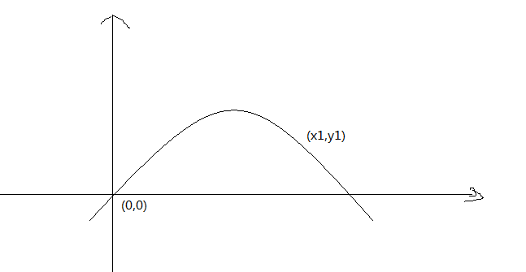
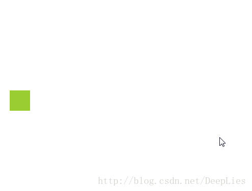
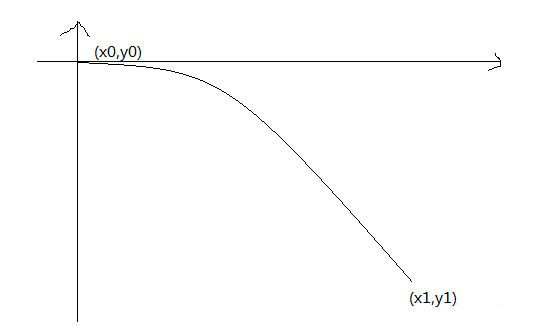
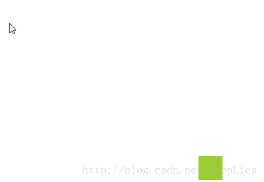

# React、Vue实现购物车小球抛物线效果

大家对下面这个动画效果想必都并不陌生了：


点击增加商品的按钮，会有一个小球做抛物线掉入购物车中，对这个动画一直很感兴趣，所以稍稍探究了一下

---
## 抛物线轨迹方程

实现此动画效果的难点在于，如何控制抛物小球在每一帧的坐标，因为只要控制好小球的每帧坐标，则小球的运动轨迹也就确定了。

一般情况下，这种抛物小球的运动轨迹都是抛物线，或者近似抛物线（例如本文开头的那个饿了么图片，小球运动感觉并不是真正的抛物线运动），道理其实都是一样的，这里先设定小球就是抛物线运动。




抛物线的一般方程为：
>y=ax^2+bx+c

其中， `x y`为坐标，所以此方程中只要确定 `a  b  c`这 3个参数的值，就能得到一条抛物线轨迹方程式。

3个参数需要 3个条件才能完全求解，也就是说只要知道抛物线轨迹上随意 3个点的坐标即可。

不过，因为这里的坐标轴是我们自己虚构的，我们是在解决实际问题，而不是解决数学问题，所以不需要太复杂，怎么简单怎么来，如果假定抛物线轨迹的起始点坐标为 `(0,0)`，那么根据上述抛物线方程可以得到 `c=0`，抛物线方程就变成了：
>y=ax^2+bx

另外， 参数 `a`实际上是一个可控的常量，通过设定 `a`的值来确定抛物线在每一点处的曲率，所以 `a`可以看做是已知的

所以，只需要求出 `b`即可：
>b=(y+ ax^2) / x

只要再知道抛物线轨迹上任意一点坐标即可，而小球所在的抛物线轨迹上，除了起始点坐标外，还有一点坐标肯定是已知的，那就是抛物线末尾坐标，即购物车元素的坐标，到此，抛物线方程就搞定了。

小球抛物线动画的关键就是这个抛物线轨迹方程，只要得到了此方程公式，剩下的就很好解决了，关于抛物线方程更多详细可见 [张鑫旭](http://www.zhangxinxu.com/wordpress/2013/12/javascript-js-%E5%85%83%E7%B4%A0-%E6%8A%9B%E7%89%A9%E7%BA%BF-%E8%BF%90%E5%8A%A8-%E5%8A%A8%E7%94%BB/)

---

## 在 React中实现抛物小球动画

搞定了抛物线方程之后，接下来就是如何处理抛物小球的问题了。

每一次点击增加按钮，就会出现一个沿着抛物线轨迹抛向购物车的小球，每个小球因为出现的坐标以及时间不同，抛物线轨迹并不一定完全重合，所以需要对这些小球进行单独控制。

可以将每个抛物小球封装成一个组件，每多处一个小球就相当于是在页面上多增加了一个此组件，需要给组件传入的关键 `props`数据有如下几个。

- 小球的起始坐标
根据上述关于抛物线方程的推导可知，想要确定此方程，需要小球的起始坐标以及末尾坐标，设定其实坐标如下表示：

```
// 起始点坐标
position = {x0, y0}
// 末尾点坐标
target = {x1, y1}
```
- 曲率 `curvature`
在上述推导的抛物线方程中，参数`a`是可控的，由我们自己来定，通过这个参数控制抛物线在各点的曲率

- 速度 `speed`
小球的运动速度也是可以控制的，通过此参数来控制小球的运动速度

- 清除函数以及小球`id`
小球在进入到购物车后会自动消失，所以这里需要处理一下，页面中可能同时存在很多个小球，根据 `id`来确定到底哪个小球需要清除掉。

根据以上推断，小球组件可以是下面这个样子：

```
<Ball
   position={position}
   target={target}
   id={id}
   curvature={curvature}
   speed={speed}
   changeFlyBallCount={changeFlyBallCount}/>
```

设定一个 `state`作为页面上的小球组件数据来源：

```
balls: []
```
`balls`数组中的每一项代表着一个需要显示的小球，当需要在页面上显示小球时，则向 `balls`中追加一个小球数据项，此项中包含小球的起始点坐标以及 一个独一无二的小球`id`（可以使用时间戳代替），如下：

```
balls: [
	{id, position: {x, y}}
]
```

当小球进入到购物车中需要被清除掉时，只需要根据 `id`查找出小球的数据项，然后将此项从 `balls`中删掉即可，如下：

```
for (let i=0; i<balls.length; i++) {
 if(balls[i].id === id) {
	// 清除小球
    balls.splice(i, 1)
    break
  }
}
```

效果如下：



---

## 在 Vue中实现抛物小球动画

上述 `react`实现的动画，如果应用在实际项目中，有的时候可能会感觉抛物线有点别扭，我们可能是希望抛物线轨迹与小球抛出点的水平方向相切，即小球抛出点坐标是抛物线的顶点，看起来会比较顺滑，类似下面这种：



如果是这样的话，那么抛物线方程就要重新设定一下了。

由于小球抛出点为顶点，顶点已知，那么可根据抛物线顶点式进行推导：

```
// 抛物线顶点式，(h,k)为顶点坐标
y=a(x-h)^2+k(a≠0)
```

设定小球起始点坐标为 `(0, 0)`，则只需要再已知一点坐标，得到参数 `a`即可，而这一点坐标显而易见可以是 抛物线末尾点坐标`(x1,y1)`上式中的参数 `a`为：
```
a = y1/(x1^2)
```

抛物线方程搞定。

这里可以使用 `Vue`动画钩子函数来完成小球抛物动画，其余的与上述 `react`大体相同，设定一个数组数据源 `balls`，当需要显示小球时，就向里面追加一个数据项，有一点需要注意，由于`Vue`动画本身的逻辑，当需要清除小球的时候，就不能像上面 `react`实现的那样直接将对应的数据项从 `balls`数组里面删除了，可以多设定一个标志变量 `show`，当需要显示的时候，将 `show`设为 `true`，当需要小球消失时，将对应的小球数据项的 `show`设为 `false`，如下：

```
// x,y为小球起始点坐标
balls: [
  {id, show, x, y}
]
```

每个小球都看作是一个 `transiton`动画，为每个动画显式声明 `appear`和`afterAppear`这两个钩子函数，在 `appear`函数中实现小球运动动画，在 `afterAppear`函数中清除小球。

效果如下：



---
动画的主体部分大概就是这样了，至于其他的一些小动画，例如小球掉入购物车时，购物车发生抖动等就很简单了，不多说。
